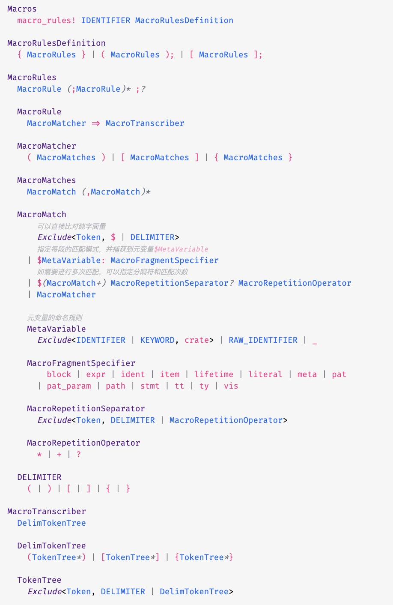

# pseudo-code

[Preview example.html](https://htmlpreview.github.io/?https://github.com/lakca/pseudo-code/blob/main/example.html)

```plain
#Macros
  `macro_rules!` [IDENTIFIER] [MacroRulesDefinition]

#MacroRulesDefinition
  `{` [MacroRules] `}` | `(` [MacroRules] `)``;` | `[` [MacroRules] `]``;`

#MacroRules
  [MacroRule] "("`;`[MacroRule]")""*" `;`"?"

  #MacroRule
    [MacroMatcher] `=>` [MacroTranscriber]

  #MacroMatcher
    `(` [MacroMatches] `)` | `[` [MacroMatches] `]` | `{` [MacroMatches] `}`

  #MacroMatches
    [MacroMatch] "("`,`[MacroMatch]")""*"

  #MacroMatch
      /可以直接比对纯字面量/
      Exclude<[Token], `$` | [DELIMITER]>
      /指定每段的匹配模式，并捕获到元变量`$MetaVariable`/
    | `$`[MetaVariable]`: `[MacroFragmentSpecifier]
      /如需要进行多次匹配，可以指定分隔符和匹配次数/
    | `$`"("[MacroMatch]"+"")" [MacroRepetitionSeparator]"?" [MacroRepetitionOperator]
    | [MacroMatcher]

    /元变量的命名规则/
    #MetaVariable
      Exclude<[IDENTIFIER] | [KEYWORD], `crate`> | [RAW_IDENTIFIER] | `_`

    #MacroFragmentSpecifier
        `block` | `expr` | `ident` | `item` | `lifetime` | `literal` | `meta` | `pat`
      | `pat_param` | `path` | `stmt` | `tt` | `ty` | `vis`

    #MacroRepetitionSeparator
      Exclude<[Token], [DELIMITER] | [MacroRepetitionOperator]>

    #MacroRepetitionOperator
      `*` | `+` | `?`

  #DELIMITER
    `(` | `)` | `[` | `]` | `{` | `}`

#MacroTranscriber
  [DelimTokenTree]

  #DelimTokenTree
    `(`[TokenTree]"*"`)` | `[`[TokenTree]"*"`]` | `{`[TokenTree]"*"`}`

  #TokenTree
    Exclude<[Token], [DELIMITER] | [DelimTokenTree]>
```


